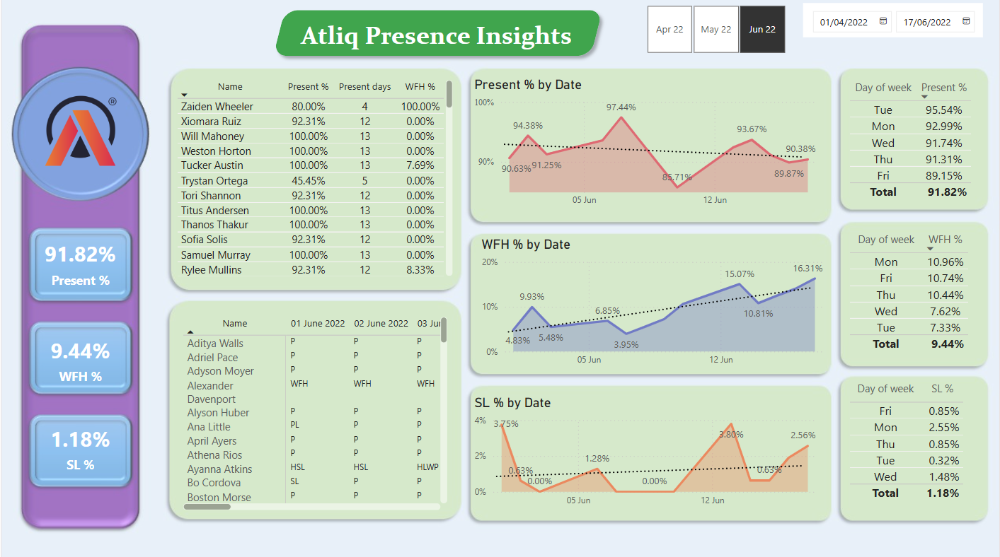

# 👥 HR Analytics Dashboard

This **HR Analytics Project** leverages the capabilities of **Power BI and Excel** to transform and visualize workforce data, providing deep insights into employee behavior and organizational trends. The project focuses on key HR metrics like **attendance**, **remote work**, and **sick leave patterns**, helping decision-makers make proactive choices.

📊 [View Interactive Dashboard](https://app.powerbi.com/view?r=eyJrIjoiYjBjNDMzY2EtM2YwYy00MWIyLTk0NjAtYzdhZDc2NDJkZDZlIiwidCI6ImM2ZTU0OWIzLTVmNDUtNDAzMi1hYWU5LWQ0MjQ0ZGM1YjJjNCJ9)  
🔗 [LinkedIn Post](https://www.linkedin.com/feed/update/urn:li:activity:7094345504221757440/)

---

## 🎯 Project Objectives

- Combine and clean multiple Excel sheets using Power BI
- Transform raw data into structured formats for accurate reporting
- Build an **interactive HR dashboard** to track key employee metrics
- Provide clear, data-driven insights to HR stakeholders

---

## ✅ Key Accomplishments

- 📌 Combined multiple Excel sheets into a unified Power BI model
- 🔧 Performed advanced **data transformation** for clean and structured analysis
- 🧠 Applied **DAX formulas** to create dynamic columns and calculated metrics
- 🧩 Designed **intuitive visuals** and KPIs for fast, informed decision-making

---

## 📊 Key Metrics Visualized

- **Attendance Percentage**  
  Interactive line charts showcasing attendance trends over time

- **Work from Home (WFH) Percentage**  
  Insightful analysis of remote work trends across the workforce

- **Sick Leave Percentage**  
  Visuals highlighting patterns and anomalies in sick leaves

---

## 📈 Dashboard Highlights

- 🧾 **Total KPI Cards**: Quick overview of key metrics at a glance
- 📉 **Trend Line Charts**: Visualize long-term performance patterns
- 📋 **Detailed Tables**: Breakdown of individual attendance, WFH, and sick leave percentages
- 📅 **Weekly Snapshot Tables**: Weekly views enabling tactical decisions for HR planning

---

## 🧠 Tools & Techniques Used

- **Power BI Desktop** for dashboard development
- **Power Query** for data transformation
- **DAX** for measures and calculated columns
- **Excel** as the raw data source

---

## 🖼️ Dashboard Preview

---

## 📎 Project Links

- 🔗 [Live Dashboard](https://app.powerbi.com/view?r=eyJrIjoiYjBjNDMzY2EtM2YwYy00MWIyLTk0NjAtYzdhZDc2NDJkZDZlIiwidCI6ImM2ZTU0OWIzLTVmNDUtNDAzMi1hYWU5LWQ0MjQ0ZGM1YjJjNCJ9)
- 🔗 [LinkedIn Post](https://www.linkedin.com/feed/update/urn:li:activity:7094345504221757440/)

---

## 🙋‍♂️ Let's Connect

If you're passionate about HR analytics, data visualization, or Power BI, feel free to connect with me:  
📬 [LinkedIn – Himel Das](https://www.linkedin.com/in/dashimel/)

---
